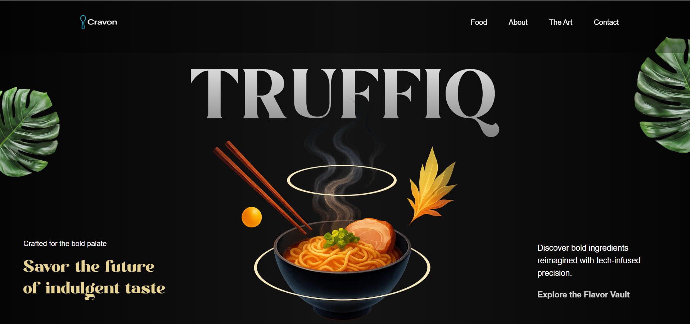

# 🍜 Truffiq — Futuristic Ramen Experience

**Truffiq** is a modern, immersive ramen-themed landing page that reimagines culinary tradition through a futuristic lens. Built with GSAP animations, custom fonts, and pixel-perfect responsiveness, it offers an unforgettable browsing experience.

---

## 🌟 Preview




---

## 🚀 Tech Stack

| Technology          | Purpose                                           |
|---------------------|---------------------------------------------------|
| React 18            | Component-based UI rendering                      |
| Vite                | Lightning-fast development + build                |
| Tailwind CSS v4     | Utility-first styling with OKLCH and `@layer`     |
| GSAP + ScrollTrigger| Animation engine for scroll-based interactions    |
| Cloudinary          | Image optimization with `f_auto,q_auto` delivery  |
| Lazy Loading        | Performance boost for mobile                      |

---

## 💡 Features

- 🎯 **Animated Hero Section** — Split text and ramen image entry with parallax
- 🌱 **Scroll-Triggered Leaves** — Left/right floating leaf elements
- 🧠 **Responsive GSAP Logic** — Mobile and desktop animations separated
- 🍜 **Cocktails + Mocktails Menus** — Dynamically rendered from constants
- 📱 **Mobile Optimized** — Full responsiveness without changing desktop view
- 🌐 **Cloudinary CDN** — Fast-loading WebP images on mobile
- 🔤 **Custom Font Preloading** — `ModernNegra.woff2` with `preload` and `crossorigin`

---

## 📁 Project Structure

src/
├── assets/ # Fonts, icons, noisy backgrounds
├── components/ # Hero, About, Cocktails, Contact
├── constants/ # Lists, hours, social links
├── styles/ # main.css with @layer base/utilities
└── App.jsx # Root layout and structur

## 🔧 Getting Started

### 1. Clone the project

```bash
git clone https://github.com/your-username/truffiq-landing.git
cd truffiq-landinge

2.Install dependencies
npm install
 Start development server

3.npm run dev
To expose locally on network:
npm run dev -- --host

📄 License
Licensed under the MIT License.
🙌 Acknowledgements

Fonts: Modern Negra

Animations: GSAP by GreenSock

Hosting: Cloudinary (for optimized media)

Design: Krishna Sahu

“Slurp into the future of flavor.”

📧 Contact: krishna.sahu.work@gmail.com

